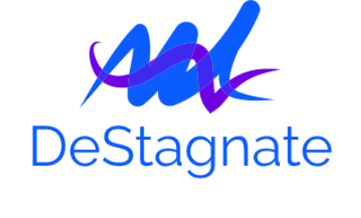

<div align="center">
    
</div>

<p align="center">
    <a href="https://github.com/Luke-zhang-04/DeStagnate/blob/master/LICENSE"></a>
    <a href="https://www.npmjs.com/package/destagnate"></a>
    <a href="https://github.com/Luke-zhang-04/DeStagnate/blob/master/dist/deStagnate.bundle.min.js"></a>
    <a href="https://www.npmjs.com/package/destagnate"></a>
    <a href="http://app.codacy.com/manual/luke.zhang2004/DeStagnate/dashboard"></a>
    <a href="https://codeclimate.com/github/Luke-zhang-04/DeStagnate"></a>
</p>

Make creating dynamic components within static sites easier with DeStagnate, a ReactJS inspired library.

[See some examples](https://luke-zhang-04.github.io/DeStagnate/)

## Why not just use React?
React is great for dynamic web applications, but it is not well optimised for static-like sites. With DeStagnate, you can create React-like componnets within the browser environment, or a bundler such as Webpack or Browserify. DeStagnate uses less resources, and was made with use in static sites as it's main purpose.

## Documentation
Documentation can be found at [https://github.com/Luke-zhang-04/DeStagnate/wiki](https://github.com/Luke-zhang-04/DeStagnate/wiki) for the latest version

## Installation
Through NPM
```bash
# NPM
npm i destagnate --save

# Yarn
yarn add destagnate
```

Through curl to download a bundle for browser usage
```bash
curl -L https://github.com/Luke-zhang-04/destagnate/releases/download/v<VERSION_NAME>/destagnate.bundle.min.js -O js/destagnate.bundle.min.js # Download minified file (recommended)

curl -L https://github.com/Luke-zhang-04/destagnate/releases/download/v<VERSION_NAME>/destagnate.bundle.js -O js/destagnate.bundle.js # Download not minfiied file (not recommended for production)
```

## Basic Use
See [https://github.com/Luke-zhang-04/DeStagnate/tree/master/docs/examples](https://github.com/Luke-zhang-04/DeStagnate/tree/master/docs/examples) and [https://github.com/Luke-zhang-04/DeStagnate/tree/master/docs/examples](https://github.com/Luke-zhang-04/DeStagnate/tree/master/docs/src) for example code
```js
// browser env requires this
const DS = DeStagnate,
    {createElement} = DS

// node env requires this
import * as DS from "destagnate"

class Counter extends DS.defualt {

    constructor (parent) {
        super(parent)

        this.state = {}
    }

    render = () => createElement("div", {})

}

// Warning: the parent must be dedicated to this component. Anything inside the parent will be removed on muatation
const counter = new Counter(document.querySelector("#parent"))

counter.mount() // Must call once to mount the component
```
